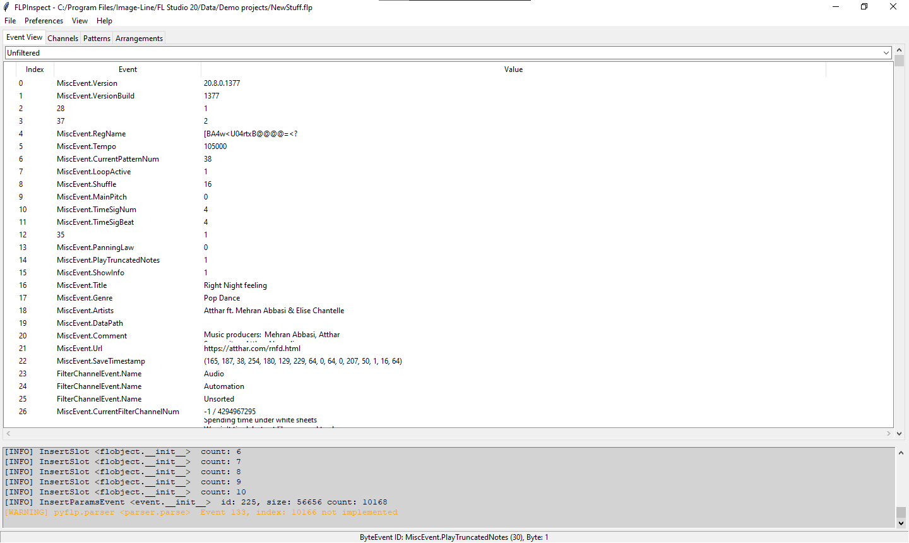

# FLPInspect

> A GUI tool to inspect and modify an FLP.

**FLPInspect**, is a GUI tool to inspect the internal event structure which is abstracted by [PyFLP](https://github.com/demberto/PyFLP).
You can read and edit FLP files.



## Installation

```
pip install --upgrade flpinspect
```

[More ways](installation.md)

## [More Screenshots](screenshots.md)

### [Project Goals & Known Issues](https://github.com/demberto/FLPInspect/blob/master/TODO.md)

## License

**FLPInspect** is licensed under the [GNU Public License v3](https://www.gnu.org/licenses/gpl-3.0.en.html)
